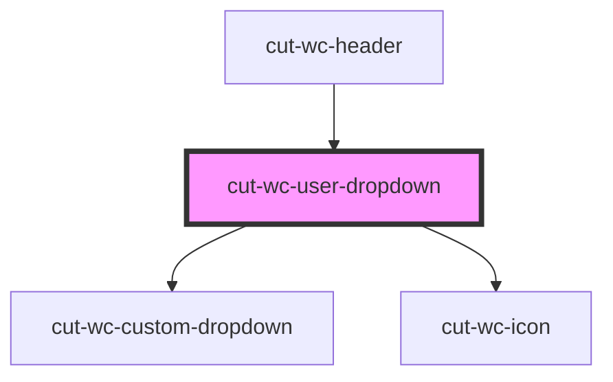

# cut-wc-user-dropdown

<!-- Auto Generated Below -->

## Properties

| Property           | Attribute | Description | Type                  | Default     |
| ------------------ | --------- | ----------- | --------------------- | ----------- |
| `userDropDownData` | --        |             | `UserDropDownModal[]` | `undefined` |
| `userInfoData`     | --        |             | `UserInfoModal`       | `undefined` |

## Events

| Event     | Description | Type               |
| --------- | ----------- | ------------------ |
| `clicked` |             | `CustomEvent<any>` |

## Dependencies

### Used by

 - [cut-wc-header](../header)

### Depends on

- [cut-wc-custom-dropdown](../custom-dropdown)
- [cut-wc-icon](../icon)

### Graph

----------------------------------------------

*Built with [StencilJS](https://stenciljs.com/)*
