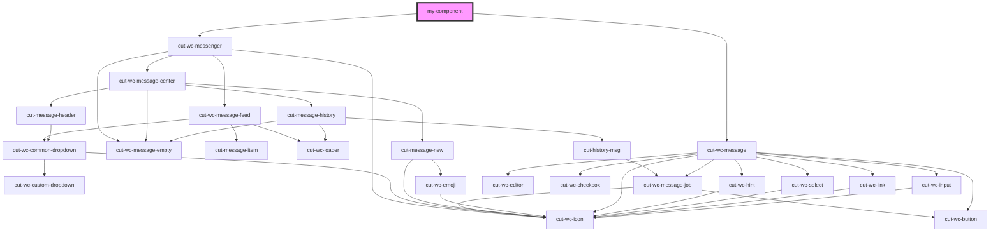

# my-component

<!-- Auto Generated Below -->

## Dependencies

### Depends on

- [cut-wc-messenger](../../components/messenger)
- [cut-wc-message](../../components/message)

### Graph

----------------------------------------------

*Built with [StencilJS](https://stenciljs.com/)*
